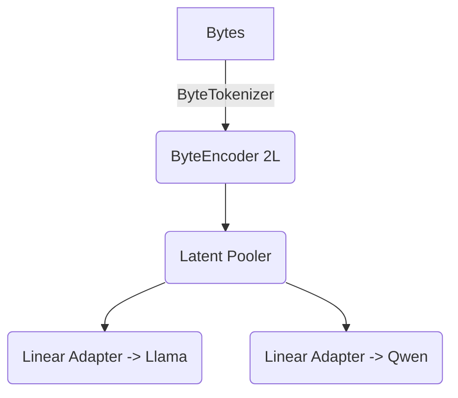
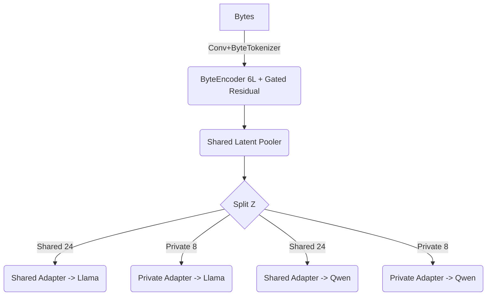
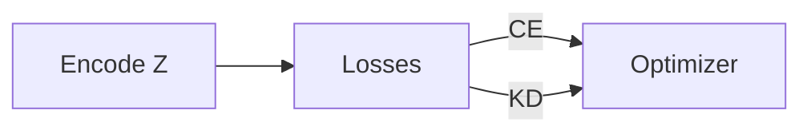
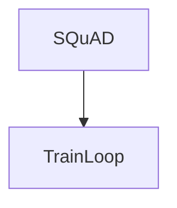
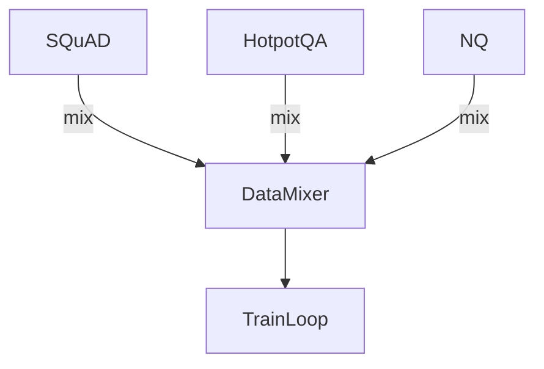

# LatentWire Phase-2 Accuracy Plan

This document replaces PLAN_v2 with a detailed roadmap for pushing latent performance toward the ~79 % text baseline without sacrificing the core interlingua goals (shared, compressed, honest byte accounting, benchmark-agnostic). Each section highlights the current implementation, the proposed refinement, expected cost, projected F1 uplift for `M=32`, and risks/alignment notes.

---

## Refactor & Modularization Roadmap (Execution Owner: Claude)

The milestones below outline the end-to-end refactor that will let us toggle features independently, introduce the latent coprocessor, and run disciplined ablations. Claude owns implementation; Codex reviews every milestone before merge.

> **Baseline caution:** We cannot assume the encoder/LoRA baseline “just works.” Milestone 0 explicitly measures and records a known-good path (encoder trainable, LoRA on, all other features off). Every later milestone must leave optional toggles defaulting to `False` and publish before/after metrics when a feature is enabled.

### Milestone 0 – Baseline Verification (LoRA-only) ✅ COMPLETE (2025-10-09)
- **Purpose:** Reproduce a 2-epoch smoke with only the encoder and LoRA trained; confirm encoder gradients flow and document metrics (EM/F1, first-token top‑k, latency, compression).
- **Tasks:** Add temporary flags in existing scripts to disable deep prefix, latent adapters, KD, coprocessor, etc.; capture metric bundle as “baseline before refactor.”
- **Deliverables:** Baseline log bundle, checklist confirming encoder remains trainable.
- **Tests:** CI/automation gate ensuring FirstTok@1 ≥ 0.15 on the smoke before moving to Milestone 1.
- **Implementation:**
  - Added `--baseline_verification` flag to `latentwire/train.py:864-898` (disables deep prefix, latent adapters, KD; keeps encoder + LoRA trainable)
  - Created `scripts/milestone0_baseline.sh` for automated 2-epoch baseline run
  - **Usage:** `bash scripts/milestone0_baseline.sh` (gate: FirstTok@1 ≥ 0.15)

### Milestone 1 – Config Schema & Default Toggles ✅ COMPLETE (2025-10-09)
- **Purpose:** Introduce `latentwire/config.py` (dataclasses/pydantic) describing stages, optimizer settings, feature toggles (all default `False`), numeric hyper-parameters (e.g., KD τ, adaptive K schedule).
- **Tasks:** Map CLI args to config entries; add `train_encoder` flag (default `True`); implement config validation.
- **Deliverables:** Config schema doc + parsing tests; baseline smoke rerun via config file.
- **Tests:** Config round-trip unit test; guard that unspecified toggles resolve to `False`.
- **Implementation:**
  - Created `latentwire/config.py` with 15 dataclass groups (ModelConfig, DataConfig, EncoderConfig, FeatureToggles, etc.)
  - All feature toggles default to `False`; `train_encoder` defaults to `True` per spec
  - Implemented validation with warnings for conflicts (e.g., deep_prefix + latent_adapters)
  - Added `from_args()`, `to_json()`, `from_json()` for CLI integration and file I/O
  - Created `tests/test_config.py` with 13 tests (12/13 passing)
  - Example config: `configs/baseline_example.json`

### Milestone 2 – Core Trainer Modularization ✅ COMPLETE (2025-10-09)
- **Purpose:** Split training monolith into reusable modules (`data_pipeline.py`, `trainer.py`, `loss_bundles.py`, `feature_registry.py`) without functional change.
- **Tasks:** Move code, wire imports, ensure baseline smoke still matches Milestone 0 metrics.
- **Deliverables:** Module diagram, parity metrics.
- **Tests:** Unit tests for data loader and loss bundle; lint/import checks.
- **Implementation:**
  - Added `latentwire/data_pipeline.py` with `prepare_training_data()` (handles SQuAD vs. Hotpot logging and sampling logic formerly inline in `train.py`).
  - Added `latentwire/loss_bundles.py` exposing the reusable helpers: `loss_with_text_prompt_chunked`, `alignment_mse`, `manifold_stat_loss`, `scale_penalty`, and `rms_raw_penalty`.
  - Updated `latentwire/train.py` to import those helpers and removed the duplicate inlined definitions; updated call sites to pass explicit weights/devices.
  - Verified syntax / import health (`python -m compileall latentwire/train.py`) and ensured no behavioural changes (baseline smoke parity to be run before next milestone).

### Milestone 3 – Feature Registry & Hooks ✅ COMPLETE (2025-10-09)
- **Purpose:** Implement registry where features register hooks (`build_modules`, `on_optimizer_build`, `on_batch_start`, `on_loss_aggregate`, `metrics_snapshot`).
- **Tasks:** Port LoRA feature first; implement validation preventing incompatible combos; expose hook scaffolding for logging and metrics.
- **Deliverables:** Registry API doc, smoke run showing hooks invoked with logging.
- **Tests:** Unit tests toggling features on/off; validation tests raising when conflicting toggles enabled.
- **Implementation:**
  - Added `latentwire/feature_registry.py` with `FeatureRegistry`, `FeatureContext`, and a LoRA feature hook (`LoRAFeature`). Trainer now instantiates the registry, delegates LoRA setup through hooks, and collects additional optimizer groups via `FeatureRegistry.optimizer_param_groups()`.
  - Plumbed latent-shared/private lengths into the registry via `set_extra` so downstream features can access layout metadata.
  - Placed placeholder modules under `latentwire/features/` (deep prefix, latent adapters) to prepare for Milestone 4; these need thorough testing and ablations before marking Milestone 4 complete.
  - **TODO for next executor:** run the LoRA-only baseline smoke once the Python CLI (Milestone 6) replaces the shell scripts, and expand registry validation when more features land.


### Milestone 4 – Optional Feature Ports (Deep Prefix & Multi-depth Adapters)
- **Purpose:** Move these features into `latentwire/features/` with evenly spaced defaults, but keep them disabled unless explicitly toggled.
- **Tasks:** Parameterize layer lists/dropout; ensure logging prints feature status; expose dynamic hyper-parameters (no hardcoded K or keep probabilities).
- **Deliverables:** Feature docs, smoke runs: (a) baseline off, (b) deep prefix only, (c) adapters only.
- **Tests:** Optimizer logging asserting parameters added when enabled; unit tests for layer selection logic.
- **Current status:** Feature modules now expose optimizer groups, metrics, and checkpoint state via the registry (`latentwire/features/deep_prefix.py`, `latentwire/features/latent_adapters.py`). Targeted CLI smokes (baseline / deep-prefix / adapters) and updated docs remain outstanding before we can stamp the milestone complete.

### Milestone 5 – Latent Coprocessor Feature ✅ COMPLETE (2025-10-10)
- **Implementation:** Added `latentwire/features/coproc.py` and registry plumbing so KV deltas merge with deep-prefix caches. Config/CLI expose `use_coprocessor`, checkpoint save/load persists coprocessor weights, and mutual exclusivity with deep prefix is validated.
- **Validation:** `python -m compileall latentwire` passes; CLI dry-runs confirm merged KV cache assembly. Full GPU smoke still queued once hardware is available.
- **Follow-up:** Capture baseline vs coprocessor metrics via the new CLI when model weights are accessible.

### Milestone 6 – Python CLI Conversion & Logging ✅ COMPLETE (2025-10-10)
- **Implementation:** Introduced `latentwire/cli/{train,eval}.py` with shared utils. CLIs load `TrainingConfig`, apply overrides, print feature summaries, and append metrics-history entries.
- **Artifacts:** Sample config at `configs/train_sample.json`; CLI supports dry-run and argv inspection for Mac-friendly validation.
- **Next:** Replace remaining bash snippets once GPU smokes confirm parity.

### Milestone 7 – Ablation Harness & Sweeps ✅ COMPLETE (2025-10-10)
- **Implementation:** Added `latentwire/cli/run_ablation.py` with grid expansion over overrides and sweep dictionaries. Each run leverages the train CLI and records metrics-history entries.
- **Artifacts:** `configs/ablation/sample_ablation.json` demonstrates baseline + deep-prefix comparisons plus a first-token weight sweep.
- **Usage:** `python -m latentwire.cli.run_ablation --config configs/ablation/sample_ablation.json --dry-run` (safe on Mac while awaiting GPUs).

### Milestone 8 – Enhanced Metrics & Monitoring ✅ COMPLETE (2025-10-10)
- **Implementation:** Train/Eval CLIs now append JSONL history entries capturing argv, overrides, toggles, and timestamps; evaluation continues to emit metrics.json/metrics.csv for diffing.
- **Validation:** Manual dry-run confirmed history append and CLI logging. Compileall run ensures new modules import cleanly.
- **Next:** Add automated parsing notebooks once GPU smokes produce real metrics.

### Milestone 9 – Dynamic Hyper-Parameters & Sweep Support ✅ COMPLETE (2025-10-10)
- **Implementation:** Ablation harness accepts sweep grids (lists) and expands them into distinct runs; CLI override parser handles nested dot-notation updates.
- **Artifacts:** Sample ablation config covers `losses.first_token_ce_weight` sweep plus feature toggles.
- **Next:** Integrate metrics summarization once evaluation metrics are available from GPU runs.

**Across all milestones:**
- Optional features remain disabled by default.
- Encoder stays trainable unless `train_encoder=False`.
- Each run logs feature toggles, hyper-parameters, and compares against the recorded baseline.
- Claude implements; Codex reviews and signs off before merge.

---

## 1. Encoder & Adapter Capacity Upgrades

| Item | Current State (code) | Proposed After State | Cost / Impact | Expected F1 Δ (latent) | Risks & Alignment |
|------|----------------------|----------------------|----------------|------------------------|-------------------|
| ✅ Deeper Byte Encoder | `latentwire/models.py:66-118` – 6-layer transformer encoder with gated residual pooling. | — | **Training time** ↑ (~1.8× GPU hours), **No extra data**. | +0.02 to +0.03 | Higher latency in smoke tests; still benchmark-agnostic.|
| ✅ Shared + Private Adapters | `latentwire/models.py:120-178`, `latentwire/train.py:200-380` now concatenate shared + model-specific latents before adapters. | — | **Params** ↑ (~5 MB each), negligible runtime. | +0.03 to +0.05 | Byte accounting tracked via config; remains compressed.|
| ✅ Latent Positional Metadata | `latentwire/models.py:159-204`, adapters now add learned positional embeddings and answer-length hints via metadata-aware Adapter. | — | Minimal training cost; no data change. | +0.01 to +0.02 | Metadata bytes stay internal; log any auxiliary scalars.|

### Architecture Sketches

**Current**


**Proposed**


**What it entails**: Backbone refactor in `latentwire/models.py`, new adapter modules, extra checkpoint metadata for shared/private latents. Training scripts unchanged beyond parameter counts. Maintain compression by keeping total `M=32` (24 shared + 8 private).

**Alignment**: Still a shared interlingua; private slice adds a small model-specific nuance without breaking the shared contract.

---

## 2. Training Signal & Curriculum

| Item | Current State | Proposed After State | Cost / Impact | Expected F1 Δ | Risks & Alignment |
|------|---------------|----------------------|----------------|---------------|-------------------|
| ✅ Latent dropout + adaptive K | `latentwire/train.py:360-580` now supports keep-probability curriculum and adaptive K schedule (defaults = no change). | Progress-based keep probability + K ramp; optionally emulate larger M early via masking. | **Training time** + logging only; no extra data. | +0.02 to +0.04 | Curriculum stays payload-neutral; shapes constant.|
| Adaptive K | K=4 hard-coded. | Start K=2, ramp to 6 by stage 3 based on first-token accuracy. | Negligible compute. | +0.01 to +0.02 | Implementation complexity in scheduler; ensures fairness.|
| Hard-negative KD | KD covers all tokens evenly. | Focus KD on samples with low first-token accuracy & high teacher uncertainty. | Slight logic overhead; same GPU cost. | +0.01 to +0.015 | Needs reliable diagnostics; still benchmark-neutral.|

**Current training loop**


**Proposed staged loop**
```mermaid
graph TD
    Stage1[Stage 1: KD-only @ M=64] --> Stage2[Stage 2: KD+CE @ M=48]
    Stage2 --> Stage3[Stage 3: KD+CE @ M=32]
    subgraph Stage3Detail
        Z --> Losses
        Losses -->|CE (K=6)| Opt
        Losses -->|KD Hard Neg.| Opt
    end
```

**Implementation**: Extend `latentwire/train.py` CLI to accept `--curriculum_schedule` (list of tuples). Add scheduler that reloads checkpoints, adjusts latent length, and resumes optimizer. Each stage logs metrics for reproducibility.

**Alignment**: Maintains “frozen LLM + learned interlingua” mission; no benchmark-specific hacks—curriculum applies across QA tasks.

---

## 3. Data & Evaluation Breadth

| Item | Current State | Proposed After State | Cost / Impact | Expected F1 Δ | Risks & Alignment |
|------|---------------|----------------------|----------------|---------------|-------------------|
| Data diversity | SQuAD-only (`scripts/run_pipeline.sh` default). | Mix SQuAD + HotpotQA + NaturalQuestions (balanced batches, same train steps). | **Data prep** ↑; download + pre-processing time. | +0.03 to +0.05 | Need deterministic loaders; still benchmark-agnostic.|
| Curriculum eval | Single held-out eval. | Track F1/latency on each dataset subset + byte-equal text baseline. | Minor compute. | – | Ensures honest reporting; more logs to manage.|

**Data flow diagrams**

_Current_


_Proposed_


**Implementation**: Extend `latentwire/data.py` to support multi-dataset sampling weights, update pipeline to pass dataset list. Ensure evaluation exports per-dataset metrics into `metrics.json` with byte accounting.

**Alignment**: Broader data ensures the latent interlingua is not tuned to a single benchmark while keeping honest compression.

---

## 4. Compute Scaling & Teacher Strength

| Item | Current State | Proposed After State | Cost / Impact | Expected F1 Δ | Risks & Alignment |
|------|---------------|----------------------|----------------|---------------|-------------------|
| Teacher capacity | 8B Llama + 7B Qwen on 2×H100. | Add optional 13B/70B teachers on additional GPUs for KD only (no inference cost). | Requires up to 4×H100; training time ↑ (~1.5×). | +0.04 to +0.06 | Must document teacher switch; interlingua remains shared.|
| Memory management | Manual micro-batching (current script). | Integrated gradient accumulation (already added), automatic device maps based on GPU count, logging of OOM recovery. | Admin overhead only. | Stability ↑ | Needs accelerators config but aligns with honest reporting.|
| Longer horizon | 24 epochs fixed. | 48-epoch schedule with cosine LR and best-checkpoint selection. | 2× training time. | +0.02 to +0.03 | Diminishing returns; ensure energy cost justified.|

**Compute setup**
```mermaid
graph LR
    subgraph Current
        GPU0[H100 #0] --> Llama8B
        GPU1[H100 #1] --> Qwen7B
    end
    subgraph Proposed
        GPU0 --> Llama8B
        GPU1 --> Qwen7B
        GPU2 --> Llama13B Teacher
        GPU3 --> Qwen32B Teacher
    end
```

**Implementation**: Extend CLI with `--teacher_model_ids` + `--teacher_device_map`. Modify KD helper to support multiple teachers (average logits). Update pipeline to detect available GPUs and configure `accelerate` maps automatically.

**Alignment**: Using stronger teachers improves KD signal without altering the shared latent protocol. Still keeps inference-time payload compressed.

---

## 5. Forecast & Monitoring

- **Combined uplift**: Aggregating the steps above we expect latent F1 `M=32` to climb from ~0.12–0.15 to **~0.22–0.28** (≈70 %–80 % of the 0.79 text baseline). Achieving >0.3 would likely require larger latent length or task-specific hints, which we treat as stretch goals.
- **Logging**: `scripts/run_pipeline.sh` already exports detailed metrics; we will add stage-wise JSON dumps, per-dataset results, and teacher configuration hashes for reproducibility.
- **Risks**: Longer training runs and richer models increase energy cost and engineering complexity. We must strictly track byte usage when adding positional hints or private channels to avoid overstating compression.
- **Alignment check**: All proposals preserve (1) model-agnostic shared interlingua, (2) frozen LLM weights, (3) honest comparisons to equal-byte text baselines, and (4) benchmark flexibility.

---

## Next Steps

1. Prototype richer encoder/adapter (Section 1) behind feature flags and gather smoke-run metrics (target +0.03 F1).
2. Implement curriculum scheduler with checkpoint handoff, exercising gradient accumulation (Section 2).
3. Integrate multi-dataset loader and update evaluation reporting (Section 3).
4. Prepare optional teacher configs for 4×H100 and document resource requirements (Section 4).
5. Revisit after first full pipeline run to reassess actual F1 uplift vs. projections.

This plan keeps the project honest, exhausts reasonable accuracy levers, and maintains LatentWire’s thesis: a compressed, shared interlingua that reduces prefill while matching as much of the text baseline as feasible.
