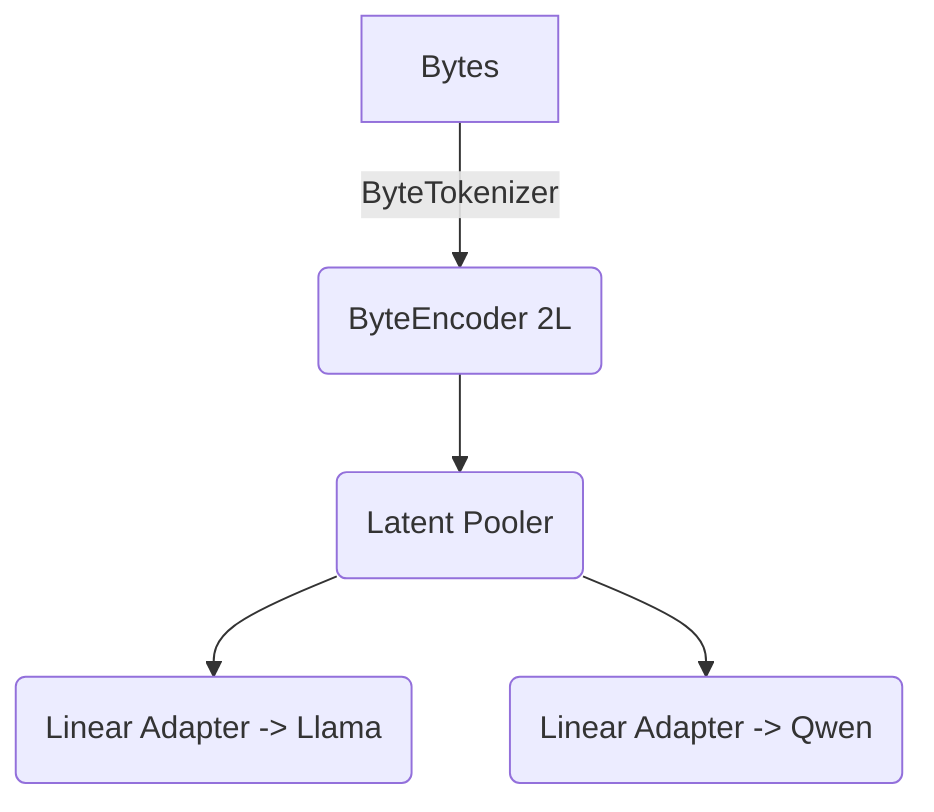
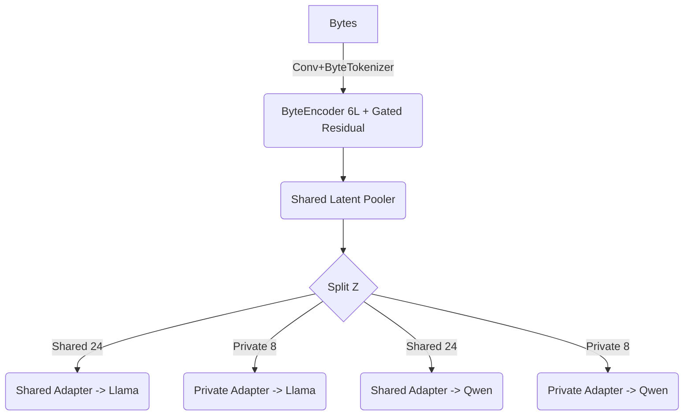
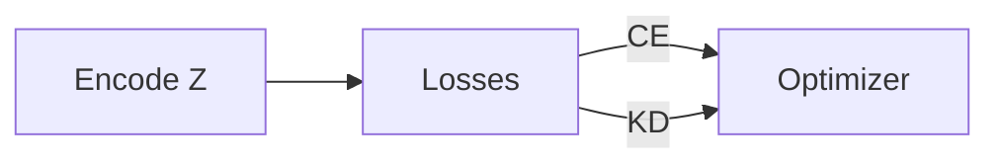
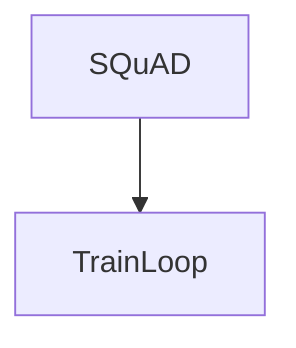
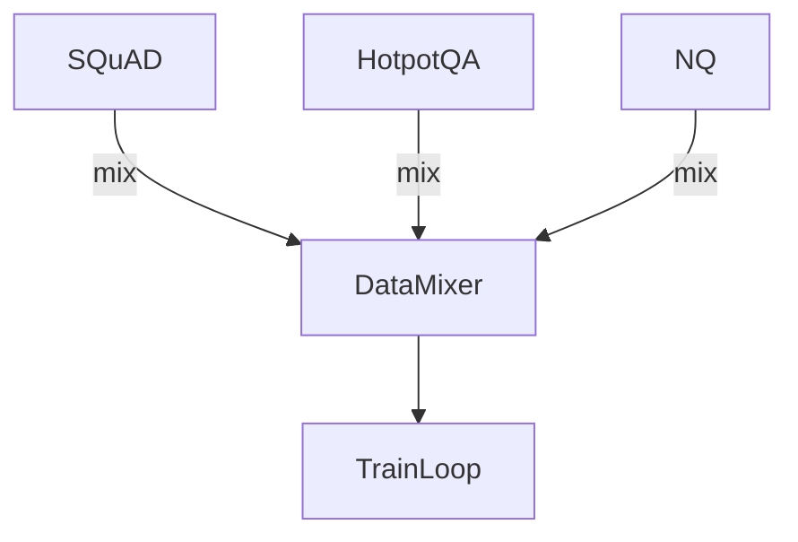

# LatentWire Phase-2 Accuracy Plan

This document replaces PLAN_v2 with a detailed roadmap for pushing latent performance toward the ~79 % text baseline without sacrificing the core interlingua goals (shared, compressed, honest byte accounting, benchmark-agnostic). Each section highlights the current implementation, the proposed refinement, expected cost, projected F1 uplift for `M=32`, and risks/alignment notes.

---

## 1. Encoder & Adapter Capacity Upgrades

| Item | Current State (code) | Proposed After State | Cost / Impact | Expected F1 Δ (latent) | Risks & Alignment |
|------|----------------------|----------------------|----------------|------------------------|-------------------|
| ✅ Deeper Byte Encoder | `latentwire/models.py:66-118` – 6-layer transformer encoder with gated residual pooling. | — | **Training time** ↑ (~1.8× GPU hours), **No extra data**. | +0.02 to +0.03 | Higher latency in smoke tests; still benchmark-agnostic.|
| ✅ Shared + Private Adapters | `latentwire/models.py:120-178`, `latentwire/train.py:200-380` now concatenate shared + model-specific latents before adapters. | — | **Params** ↑ (~5 MB each), negligible runtime. | +0.03 to +0.05 | Byte accounting tracked via config; remains compressed.|
| ✅ Latent Positional Metadata | `latentwire/models.py:159-204`, adapters now add learned positional embeddings and answer-length hints via metadata-aware Adapter. | — | Minimal training cost; no data change. | +0.01 to +0.02 | Metadata bytes stay internal; log any auxiliary scalars.|

### Architecture Sketches

**Current**


**Proposed**


**What it entails**: Backbone refactor in `latentwire/models.py`, new adapter modules, extra checkpoint metadata for shared/private latents. Training scripts unchanged beyond parameter counts. Maintain compression by keeping total `M=32` (24 shared + 8 private).

**Alignment**: Still a shared interlingua; private slice adds a small model-specific nuance without breaking the shared contract.

---

## 2. Training Signal & Curriculum

| Item | Current State | Proposed After State | Cost / Impact | Expected F1 Δ | Risks & Alignment |
|------|---------------|----------------------|----------------|---------------|-------------------|
| Cold-start schedule | Single stage: CE+KD on full task (`latentwire/train.py:465-615`). | 3-phase curriculum: (1) KD-only @ M=64, (2) KD+CE @ M=48, (3) final @ M=32 with full losses. | **Training time** ↑ (~2.2× total steps). | +0.03 to +0.04 | Requires smooth checkpoint handoff; more bookkeeping.|
| Adaptive K | K=4 hard-coded. | Start K=2, ramp to 6 by stage 3 based on first-token accuracy. | Negligible compute. | +0.01 to +0.02 | Implementation complexity in scheduler; ensures fairness.|
| Hard-negative KD | KD covers all tokens evenly. | Focus KD on samples with low first-token accuracy & high teacher uncertainty. | Slight logic overhead; same GPU cost. | +0.01 to +0.015 | Needs reliable diagnostics; still benchmark-neutral.|

**Current training loop**


**Proposed staged loop**
```mermaid
graph TD
    Stage1[Stage 1: KD-only @ M=64] --> Stage2[Stage 2: KD+CE @ M=48]
    Stage2 --> Stage3[Stage 3: KD+CE @ M=32]
    subgraph Stage3Detail
        Z --> Losses
        Losses -->|CE (K=6)| Opt
        Losses -->|KD Hard Neg.| Opt
    end
```

**Implementation**: Extend `latentwire/train.py` CLI to accept `--curriculum_schedule` (list of tuples). Add scheduler that reloads checkpoints, adjusts latent length, and resumes optimizer. Each stage logs metrics for reproducibility.

**Alignment**: Maintains “frozen LLM + learned interlingua” mission; no benchmark-specific hacks—curriculum applies across QA tasks.

---

## 3. Data & Evaluation Breadth

| Item | Current State | Proposed After State | Cost / Impact | Expected F1 Δ | Risks & Alignment |
|------|---------------|----------------------|----------------|---------------|-------------------|
| Data diversity | SQuAD-only (`scripts/run_pipeline.sh` default). | Mix SQuAD + HotpotQA + NaturalQuestions (balanced batches, same train steps). | **Data prep** ↑; download + pre-processing time. | +0.03 to +0.05 | Need deterministic loaders; still benchmark-agnostic.|
| Curriculum eval | Single held-out eval. | Track F1/latency on each dataset subset + byte-equal text baseline. | Minor compute. | – | Ensures honest reporting; more logs to manage.|

**Data flow diagrams**

_Current_


_Proposed_


**Implementation**: Extend `latentwire/data.py` to support multi-dataset sampling weights, update pipeline to pass dataset list. Ensure evaluation exports per-dataset metrics into `metrics.json` with byte accounting.

**Alignment**: Broader data ensures the latent interlingua is not tuned to a single benchmark while keeping honest compression.

---

## 4. Compute Scaling & Teacher Strength

| Item | Current State | Proposed After State | Cost / Impact | Expected F1 Δ | Risks & Alignment |
|------|---------------|----------------------|----------------|---------------|-------------------|
| Teacher capacity | 8B Llama + 7B Qwen on 2×H100. | Add optional 13B/70B teachers on additional GPUs for KD only (no inference cost). | Requires up to 4×H100; training time ↑ (~1.5×). | +0.04 to +0.06 | Must document teacher switch; interlingua remains shared.|
| Memory management | Manual micro-batching (current script). | Integrated gradient accumulation (already added), automatic device maps based on GPU count, logging of OOM recovery. | Admin overhead only. | Stability ↑ | Needs accelerators config but aligns with honest reporting.|
| Longer horizon | 24 epochs fixed. | 48-epoch schedule with cosine LR and best-checkpoint selection. | 2× training time. | +0.02 to +0.03 | Diminishing returns; ensure energy cost justified.|

**Compute setup**
```mermaid
graph LR
    subgraph Current
        GPU0[H100 #0] --> Llama8B
        GPU1[H100 #1] --> Qwen7B
    end
    subgraph Proposed
        GPU0 --> Llama8B
        GPU1 --> Qwen7B
        GPU2 --> Llama13B Teacher
        GPU3 --> Qwen32B Teacher
    end
```

**Implementation**: Extend CLI with `--teacher_model_ids` + `--teacher_device_map`. Modify KD helper to support multiple teachers (average logits). Update pipeline to detect available GPUs and configure `accelerate` maps automatically.

**Alignment**: Using stronger teachers improves KD signal without altering the shared latent protocol. Still keeps inference-time payload compressed.

---

## 5. Forecast & Monitoring

- **Combined uplift**: Aggregating the steps above we expect latent F1 `M=32` to climb from ~0.12–0.15 to **~0.22–0.28** (≈70 %–80 % of the 0.79 text baseline). Achieving >0.3 would likely require larger latent length or task-specific hints, which we treat as stretch goals.
- **Logging**: `scripts/run_pipeline.sh` already exports detailed metrics; we will add stage-wise JSON dumps, per-dataset results, and teacher configuration hashes for reproducibility.
- **Risks**: Longer training runs and richer models increase energy cost and engineering complexity. We must strictly track byte usage when adding positional hints or private channels to avoid overstating compression.
- **Alignment check**: All proposals preserve (1) model-agnostic shared interlingua, (2) frozen LLM weights, (3) honest comparisons to equal-byte text baselines, and (4) benchmark flexibility.

---

## Next Steps

1. Prototype richer encoder/adapter (Section 1) behind feature flags and gather smoke-run metrics (target +0.03 F1).
2. Implement curriculum scheduler with checkpoint handoff, exercising gradient accumulation (Section 2).
3. Integrate multi-dataset loader and update evaluation reporting (Section 3).
4. Prepare optional teacher configs for 4×H100 and document resource requirements (Section 4).
5. Revisit after first full pipeline run to reassess actual F1 uplift vs. projections.

This plan keeps the project honest, exhausts reasonable accuracy levers, and maintains LatentWire’s thesis: a compressed, shared interlingua that reduces prefill while matching as much of the text baseline as feasible.
