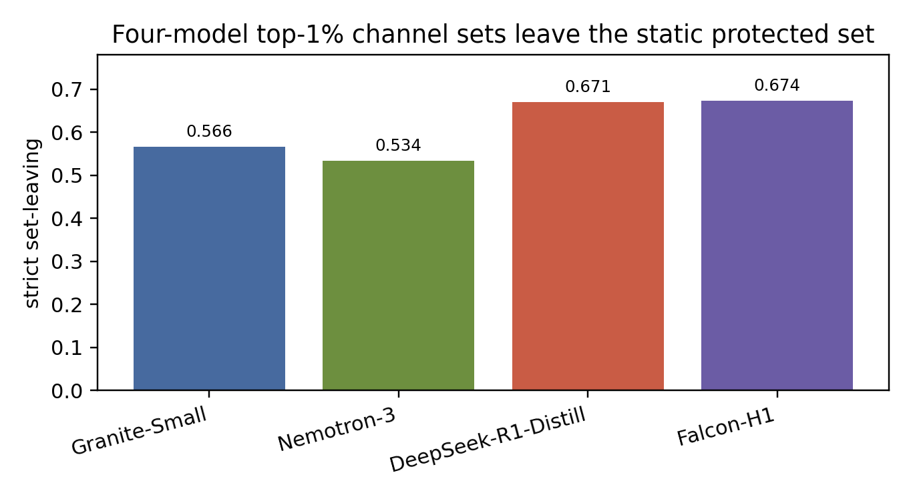
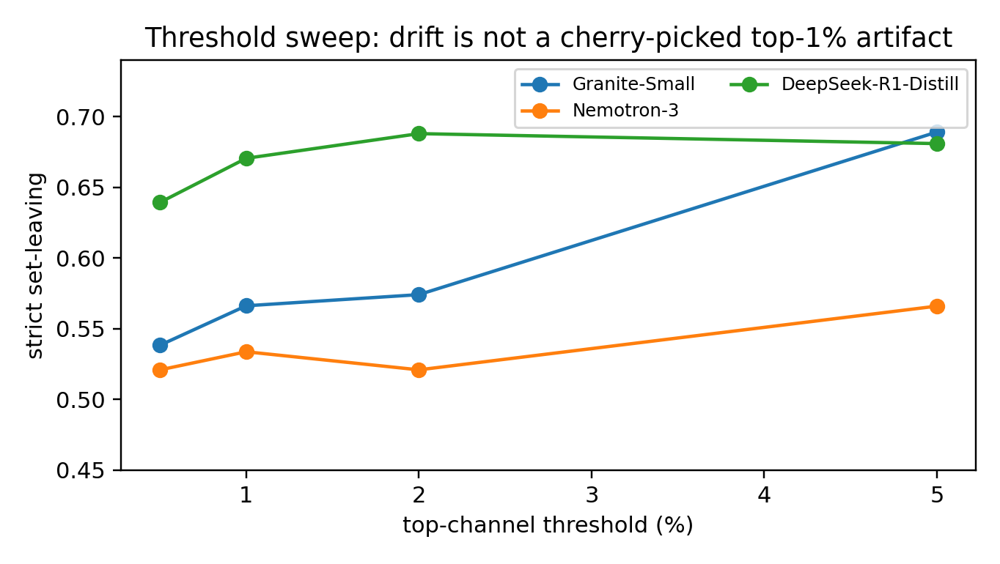
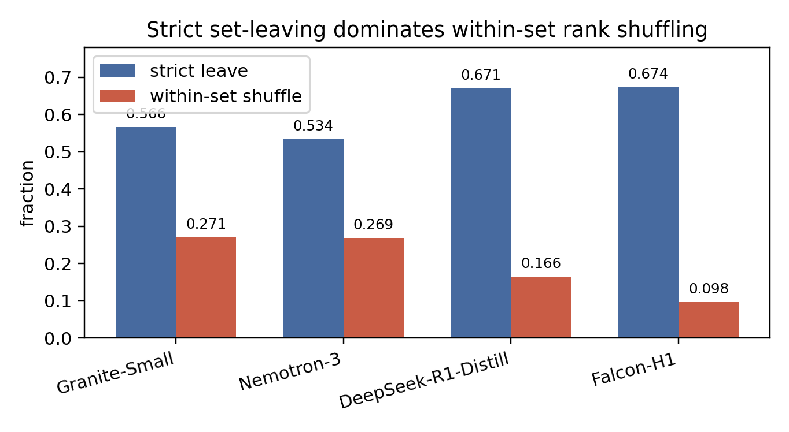
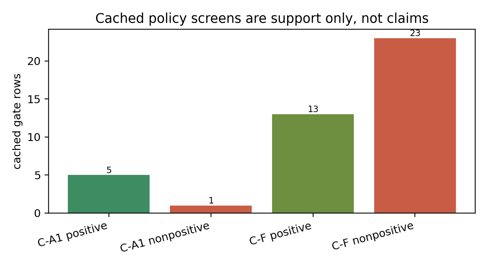
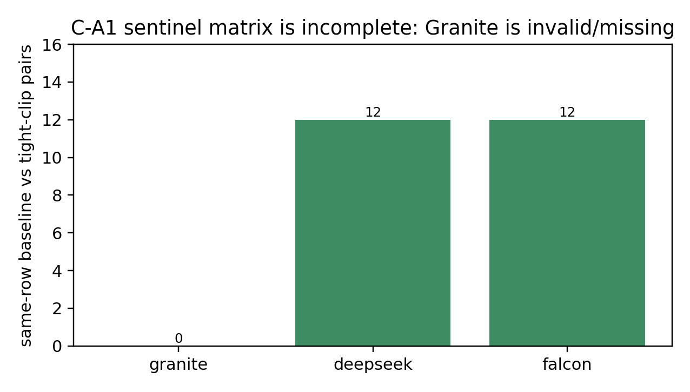
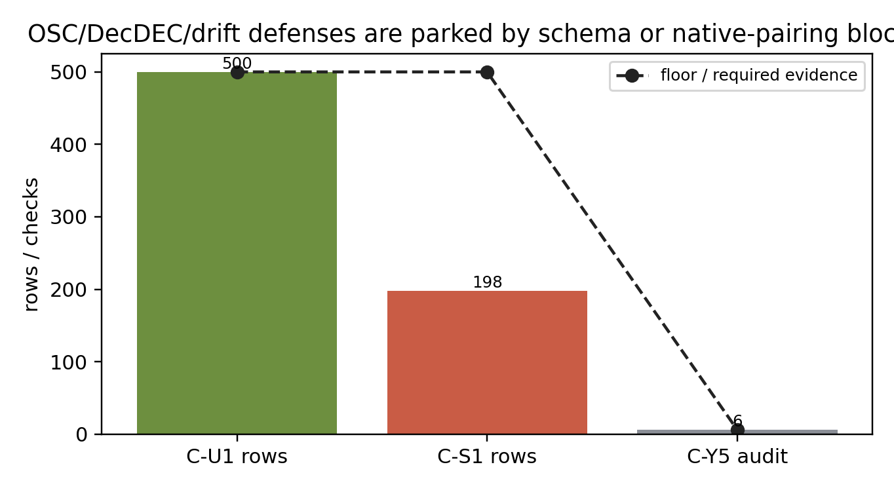

# Channel Sets Drift During Long Reasoning

## A Measurement Regime For Static W4A16 Protection

## Abstract

W4A16 long-reasoning quantization often protects a fixed set of high-risk activation channels. Channel-Set asks whether that static unit is stable enough to support a positive method. The current evidence supports a measurement/regime result rather than a confirmed adaptive method: top-1% strict set-leaving is `0.566235` for Granite-Small, `0.533713` for Nemotron-3, `0.670573` for DeepSeek-R1-Distill, and `0.673611` for Falcon-H1. This measurement tensions a competing account: OSC-style static protection is motivated by token-persistent outlier channel clusters, but long-decode high-risk sets drift at the trace level. C-A1 remains parked because the cached gate path was contaminated and the fresh three-model same-row ParoQuant-vs-tight-clip matrix is missing. The paper contributes a scoped regime claim: static channel-set protection is a weak abstraction for these long-reasoning traces, and any future positive method must beat ParoQuant/static baselines under split-clean same-row native evidence.

## Claim-Boundary Box

| Supported | Unsupported | Future-only |
| --- | --- | --- |
| Top-1% strict set-leaving is high across Granite-Small, Nemotron-3, DeepSeek-R1-Distill, and Falcon-H1: `0.533713` to `0.673611`. | A confirmed-positive claim is unsupported. | C-A1 can become a positive only after fresh split-clean native paired materialization. |
| Drift is not a single-threshold artifact for the models with threshold-sweep artifacts. | C-A1 is not confirmed and does not beat ParoQuant in a claim-ready way. | A GPU/native systems card remains separate from this paper-finalization pass. |
| C_U1, C_S1, and C_Y5 blockers are real schema/floor/native-pairing blockers. | No held-out method confirmation is claimed. | OSC/DecDEC defenses can validate a future method after same-row pairing exists. |

## 1. Introduction

Long reasoning changes which activation channels matter. A static W4A16 outlier-protection method can work only if the protected channel set remains stable enough across the reasoning trace. The Channel-Set campaign tested adaptive possibilities, but the confirmed result is simpler and sharper: the set itself moves.

This measurement tensions a competing account. Recent W4A16 work such as OSC [@osc2026] motivates static protection by arguing activation outliers form token-persistent channel clusters, a fixed object stable enough to protect once. Our long-decode measurement shows the opposite for the top-1% high-risk set: `53`-`67`% of later high-risk channels lie outside the set selected early in the trace. The two are reconcilable: token-local clusters can persist while the trace-level high-risk set drifts. That reconciliation is the point. Static protection chosen from an early window is the wrong granularity for long reasoning, and any method inheriting it must be validated against trace-level drift, not token-local persistence alone.

This matters for both method design and evaluation. If later high-risk channels leave the early protected set, then a static top-channel abstraction is incomplete. If an adaptive method appears to win without a paired ParoQuant/static baseline on the same rows, the win may be a cache artifact or a contaminated split artifact rather than a real method.

Contributions:

1. A four-model long-reasoning channel-set drift measurement. At top 1%, strict set-leaving is above `0.53` for every reported headline model (Figure 1).

2. A threshold sweep showing that the result is not a single chosen threshold for Granite-Small, Nemotron-3, and DeepSeek-R1-Distill (Figure 2). Falcon-H1 has a top-1 decomposition but not the same threshold-sweep artifact.

3. A separation between strict set-leaving and within-set rank shuffling (Figure 3).

4. An audit-preserving regime map. C-A1 remains parked; C_U1, C_S1, and C_Y5 are blocked by missing schema, floor, or native-pairing requirements.

Figure 1: Four-model top-1% set-leaving. More than half of later high-risk channels leave the static protected set in every reported headline model. This is cached measurement evidence, not a positive-method claim.

## 2. Measurement Setup And Error Model

For a top-k channel threshold, define the protected set at one trace segment and ask how many later high-risk channels are outside that set. This is strict set-leaving. A value near zero would support static protection; a value above one half means the static set misses a large portion of later high-risk channels.

Within-set shuffling is measured separately: among channels that remain inside the protected set, their relative rank can still change. This affects allocation inside a fixed protected set but cannot recover channels that leave the set entirely.

The downstream relevance of set-leaving follows from a simple error model. A channel inside the protected set incurs the protected per-channel error `epsilon_p`; a high-risk channel that has left it incurs the unprotected error `epsilon_q >> epsilon_p`. Writing `L(t0,t)` for the fraction of later high-risk channels outside the set chosen at `t0`, the expected excess quantization error behaves as `E[err(t)] ~= K { epsilon_p (1 - L(t0,t)) + epsilon_q L(t0,t) }`, which is increasing in `L`. Set-leaving is therefore not merely a membership statistic: under this model the measured `L` of `0.53`-`0.67` places a large fraction of later high-risk channels at the unprotected error rate. The model assumes leaving channels carry comparable risk to those retained; we treat the per-channel error attribution itself as the parked C-A1 question and claim no confirmed accuracy delta here.

The detailed provenance is in `tables/provenance.md`; the final regime checklist is in `tables/regime_checklist.md`.

## 3. Results

### 3.1 Four-Model Top-1% Strict Set-Leaving Is Large

| Model | Strict set-leaving | Within-set shuffling | Artifact status |
| --- | ---: | ---: | --- |
| Granite-Small | `0.566235` | `0.270935` | threshold sweep available |
| Nemotron-3 | `0.533713` | `0.269082` | threshold sweep available |
| DeepSeek-R1-Distill | `0.670573` | `0.165737` | threshold sweep available |
| Falcon-H1 | `0.673611` | `0.097538` | top-1 decomposition available |

The top-1% values all exceed `0.53`, and the largest reaches `0.673611`. Static protection is therefore not a sufficient abstraction for these traces.

### 3.2 The Result Is Stable Across Available Threshold Sweeps

Figure 2: Cached threshold sweep for Granite-Small, Nemotron-3, and DeepSeek-R1-Distill. Strict set-leaving remains high across 0.5%, 1%, 2%, and 5%. Falcon-H1 is omitted here because only its top-1 decomposition artifact is available.

The threshold sweep reports all thresholds rather than selecting one post hoc. The exact values move, but the regime does not: strict set-leaving stays high across nearby thresholds for the models with sweep artifacts.

### 3.3 Strict Leaving Dominates Within-Set Shuffling

Figure 3: Four-model strict set-leaving versus within-set shuffling. Within-set shuffling exists, but strict set-leaving is the larger effect.

Within-set shuffling at top 1% ranges from `0.097538` to `0.270935`. That is nontrivial, but it is smaller than strict set-leaving. The main failure mode for a static set is not only that the protected channels change rank; many later high-risk channels are absent from the protected set at all.

## 4. Why C-A1 Is Parked, Not Confirmed

Figure 4: Cached C-A1 and C-F screens are support evidence only. They are not native same-row ParoQuant comparisons and cannot carry a positive claim.

C-A1 remains the nearest positive-method candidate, but it is not a paper claim. The cached screen has only `6` C-A1 gate rows, with `5` positive medians and `1` nonpositive median. That is enough to motivate a fresh materialization, not enough to claim a method.

Figure 5: The split-clean C-A1 sentinel matrix is incomplete. DeepSeek and Falcon have `12` same-row pairs, while Granite has `0` valid same-row pairs in the safe manifest.

The blocker is concrete and unavoidable. A future claim needs a Granite/DeepSeek/Falcon same-row matrix with ParoQuant baseline and tight-clip C-A1 outputs. The safe manifest has DeepSeek and Falcon same-row pairs, but Granite is missing/invalid. C-A1 remains parked until this is rebuilt. This paper therefore does not claim a C-A1 win, does not claim to beat ParoQuant, and does not claim held-out confirmation.

## 5. Defense Scaffold And Schema Blockers

Figure 6: Defense and router ideas are a blocker map, not completed defense proof. They are blocked by missing labels, insufficient rows, or missing native pairing.

The defense stack is useful because it prevents overclaiming:

- C_U1 materializes `500` KL trajectory rows, but lacks paired difficulty/policy-uplift labels.
- C_S1 finds only `198` eligible rows against a `500` row floor. The floor is not lowered.
- C_Y5 has defense inputs and audit checks, but the three-model native C-A1-vs-ParoQuant packet is missing.

These are honest blockers, not negative proof against every future method. They define the evidence required before a positive Channel-Set method can be claimed.

## 6. Related Work And Regime Guidance

Channel-Set is closest to W4A16 quantization, outlier-channel protection, rotation-based quantization, and residual correction methods such as ParoQuant [@paroquant2026], OSC [@osc2026], DecDEC [@decdec2024], ResQ [@resq2024], OSCAR [@oscar2026], and OScaR [@oscar_kv2026]. Those systems are the correct baseline family for any future adaptive method.

The distinguishing view here is the long-reasoning channel-set object itself. Rather than assuming a protected channel set and measuring final answer accuracy, this paper measures whether the protected set remains the same object over the reasoning trace.

The regime checklist is the deliverable. A future method must measure drift, lock ParoQuant/static/EMA baselines, preserve no-gap denominators, require same-row native evidence, and treat C-A1-like tail/CVaR policies as parked until the full matrix exists.

## 7. Limitations

This is a measurement/regime paper, not a confirmed positive-method paper. C-A1 remains parked. The paper does not claim to beat ParoQuant, does not claim a native GPU result, and does not claim held-out method confirmation.

The measurements are cached decomposition evidence. They are strong enough to establish the static-set drift regime, but a method claim needs fresh split-clean native paired rows, model/policy hashes, no-gap denominators, and write-once per-trace evidence.

The claim is also not that static channel sets are always wrong. It is that, in these long-reasoning packets, strict set-leaving is large enough that static protection alone is a weak abstraction.

## 8. Conclusion

Channel-Set contributes a scoped but useful result: long-reasoning outlier channel sets drift. At top 1%, more than half of later high-risk channels leave the static protected set in every reported headline model. That turns static W4A16 protection from a stable object into a fragile assumption. A positive method may still emerge from C-A1 or related adaptive policies, but only after fresh split-clean native paired materialization and the full ParoQuant/audit gate.
