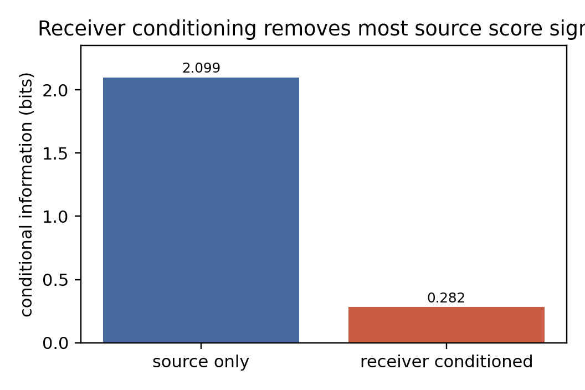
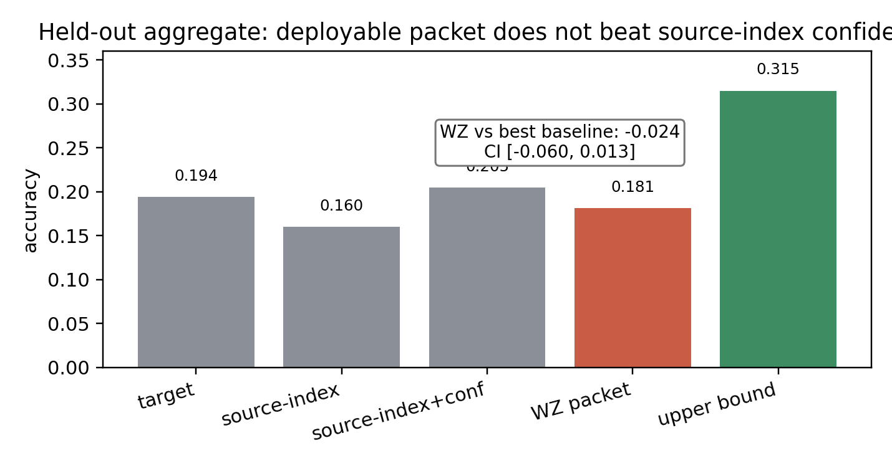
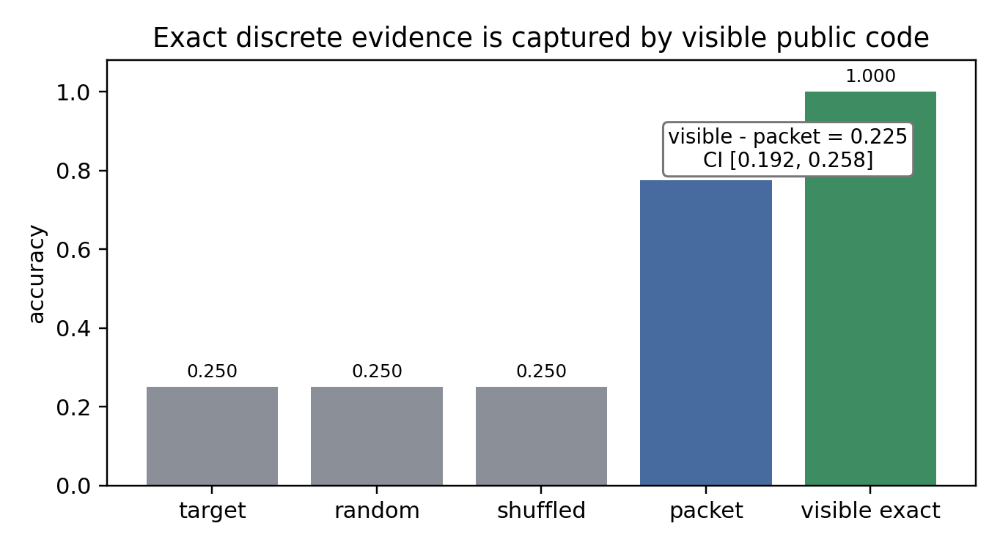
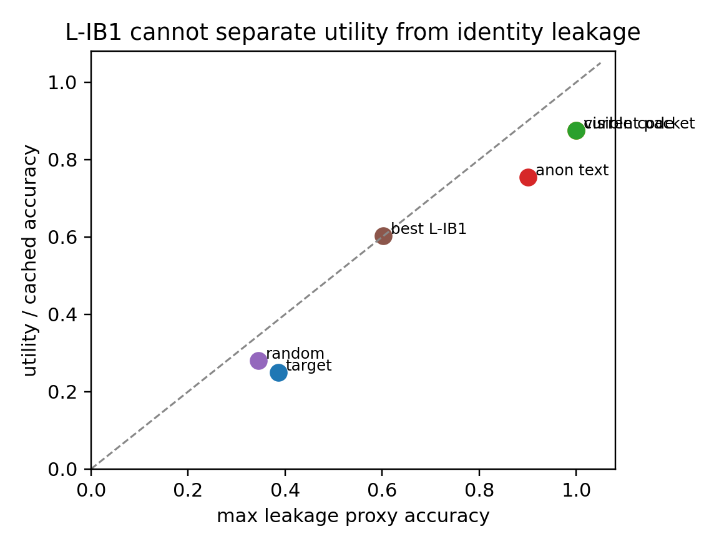

# When Byte-Scale Model Communication Should Be Text

## Abstract

LatentWire asks whether a source model can send a small no-text packet that improves a receiver model beyond ordinary score and text baselines. The completed evidence supports a bounded negative for the discrete, byte-scale regime that is currently claim-ready. One-way score and residual packets do not beat source-index/confidence controls on the held-out aggregate, and the powered score ladder shows why: apparent source information drops from `2.098527` bits to `0.281933` bits after conditioning on receiver evidence. The strongest discrete-evidence escape fails in the opposite direction: when the same exact symbolic evidence is exposed as a visible 2-byte public code, it reaches `1.000` accuracy versus `0.775` for the matched learned packet, a `+0.225` advantage with 95% CI `[0.192188, 0.257812]`. The last cheap privacy-bottleneck escape also fails: L-IB1 is `KILL_UTILITY_IS_IDENTITY`, with the current packet at utility/leakage `0.875/1.000` and the best bottleneck at only `0.602339/0.602339`. The contribution is a claim-boundary result: for discrete low-byte evidence, no-text latent packets are dominated by score controls or equal-byte visible evidence unless the method moves to continuous dense state or a genuinely privacy-preserving bottleneck.

## Claim-Boundary Box

| Supported | Unsupported | Future-only |
| --- | --- | --- |
| Score-like source packets are bounded negative under source-index/confidence controls. | A deployable-positive claim is unsupported. | Continuous dense cache/state transfer may still work, but it is outside this byte-scale discrete packet result. |
| Exact discrete evidence is text-capturable under the same byte budget in the local cache. | L-IB1 is not a privacy positive; it remains `KILL_UTILITY_IS_IDENTITY`. | A reviewed neural privacy bottleneck would need matched visible/anonymized text controls. |
| Gold-aware oracle ceilings are rejected as leakage or gap-to-perfect measurements. | No cross-family, dense-cache, native GPU, or systems-speed claim is made. | Stronger generated-candidate reranking remains possible only with gold-blind verifier/source/target scores. |

## 1. Introduction

Small model-to-model messages are attractive because they promise communication without exposing full reasoning traces. The hard question is not whether a helper model knows something useful. It is whether a byte-scale no-text packet conveys information that the receiver cannot already recover from its own scores, the source identity, or an equal-byte visible code.

This campaign originally searched for a positive LatentWire method. The result is a stronger and more useful boundary: the discrete evidence that makes a packet useful is visible-code capturable, while score-like residual signals mostly disappear after receiver conditioning. The paper therefore argues for a conservative standard for future model communication work: the relevant delta is not improvement over target-only, but improvement beyond source-index, source-confidence, equal-byte text, wrong-row, and destructive controls.

Contributions:

1. A controlled bounded negative for deployable score/residual packets. On the held-out aggregate with `381` rows, the deployable score packet is `-0.023622` below source-index/confidence with CI `[-0.060367, 0.013123]`. On the powered dev/gate ladder with `1500` scored rows and `359` gate rows, the current deployable packet is `-0.013928` below the best score baseline with CI `[-0.050139, 0.022284]`.

2. A mechanism for the negative result. Source scores contain `2.098527` bits before receiver conditioning, but only `0.281933` bits after conditioning on receiver evidence (Figure 1).

3. A direct exact-discrete evidence test. On `640` model-helper rows over `160` unique examples, a matched model packet reaches `0.775` accuracy, while the exact same symbolic evidence serialized as visible public code reaches `1.000` (Figure 2). Random, shuffled, answer-only, and target-only controls remain at `0.250`.

4. A final cheap privacy escape test. L-IB1 cannot preserve current-packet utility while hiding source/evidence identity (Figure 3).

Figure 1: The source-score signal largely disappears once receiver evidence is included.

## 2. Experimental Design

All results in this paper are drawn from existing aggregate or cached non-claim artifacts. No new experiment, GPU run, MPS live forward, confirmation split access, or killed-method rerun is used in this paper-finalization pass. The package includes generated figures, provenance tables, and review records only.

The main evidence families are:

- deployable one-way score/residual packets;
- the powered score ladder and receiver-conditioning information estimate;
- L-Q1 receiver-query packet controls;
- exact-discrete evidence versus equal-byte visible code;
- L-IB1 cached privacy-bottleneck frontier;
- rejected oracle ceilings and dense/cache smokes used only as boundary evidence.

The paper's numeric claims map to package-local figures and tables. The detailed provenance is in `tables/provenance.md`; the falsification ladder is in `tables/falsification_ladder.md`.

## 3. Falsification Ladder

The central asset of this paper is not a single negative row. It is a ladder of increasingly plausible escapes, each killed or parked by a concrete hard baseline.

See `tables/falsification_ladder.md` for the complete table. The short version is:

| Escape | Result | Controlling baseline |
| --- | --- | --- |
| Score/WZ one-way packet | held-out delta `-0.023622`, CI `[-0.060367, 0.013123]` | source-index+confidence |
| Powered score ladder | current packet delta `-0.013928`, CI `[-0.050139, 0.022284]` | best equal-byte score/source baseline |
| L-B1 trust packet | killed as source-copy/damage-avoidance failure | source-index/source-selected metadata |
| L-Q1 receiver query | delta `-0.022284`, CI `[-0.055710, 0.011142]` | source-index+confidence and ablations |
| Exact discrete evidence | visible code beats packet by `+0.225` | equal-byte public code |
| L-IB1 privacy bottleneck | best bottleneck `0.602339/0.602339` vs current `0.875/1.000` | same-byte code and anonymized text |
| Oracle fuser/verifier ceilings | rejected as gold-aware or setup-blocked | gold-leakage audit |

## 4. Results

### 4.1 Deployable Packets Do Not Beat Source-Index Confidence

Figure 2: On the held-out aggregate, the deployable packet does not beat the source-index/confidence baseline. The source+target-at-encoder upper bound is positive but non-deployable.

The held-out aggregate shows the exact boundary. Target-only accuracy is `0.194226`, source-index+confidence is `0.204724`, and the deployable WZ packet is `0.181102`. The source+target-at-encoder upper bound reaches `0.314961`, so the experiment is not merely noise. The problem is deployability: the useful signal appears when the encoder has target evidence, not in the allowed source-only low-byte packet.

### 4.2 Receiver Conditioning Explains The Null

The powered ladder estimates `2.098527` bits of source-score information before receiver conditioning and `0.281933` bits afterward. Same-family models on shared multiple-choice tasks often fail and succeed for overlapping reasons. A source packet can therefore appear useful until the receiver's own evidence and the source identity are included as baselines.

This result also explains why source-only oracle gaps are not enough. A positive source+target-at-encoder upper bound says there is information in the joint state; it does not say a deployable source-only byte packet transmits it.

### 4.3 Exact Discrete Evidence Is Better Sent As Text

Figure 3: The exact visible public signature reaches `1.000` accuracy, while the learned matched packet reaches `0.775`. Controls remain at chance.

The exact-discrete evidence test is the cleanest negative result. The matched learned packet is useful, but the exact symbolic evidence that makes it useful is also public-code serializable inside the same byte budget. When the receiver gets that code visibly, it reaches perfect accuracy in this cache.

This is not a universal impossibility theorem. The sample has `640` model-helper rows but only `160` unique examples. We therefore state it as an operational theorem for this class of evidence: if the useful content is a finite symbolic evidence signature and equal-byte visible public code is allowed, the opaque packet has no inherent no-text advantage.

### 4.4 L-IB1 Does Not Produce A Privacy-Positive Packet

Figure 4: L-IB1 cannot move off the utility/leakage identity diagonal enough to preserve utility while hiding source/evidence structure.

L-IB1 asked whether an adversarial feature selector could keep utility while hiding source/evidence identity on `512` cached rows. It could not. The current high-utility packet has cached utility `0.875` and max leakage `1.000`; the best bottleneck has proxy utility `0.602339` and max leakage `0.602339`. The exact public code matches current-packet utility and leakage, while adaptive anonymized text remains a necessary comparator for any future privacy claim.

The verdict remains `KILL_UTILITY_IS_IDENTITY`. This is a cached gate, not a formal privacy impossibility result. It kills the cheap local escape and sets the bar for a future build-scale IB method.

### 4.5 Rejected Oracle Ceilings Are Not Communication Claims

Two large apparent ceilings are explicitly excluded. L-PC5's strict rerank oracle and L-C2's strict fuser oracle measure answer-aware or setup-blocked gaps, not deployable no-text communication. The gold-blind L-PC5 attempt reaches only `82` prompts, below its required floor, and ties the equal-byte text control. L-C2 has no reviewed gold-free hidden-state fuser objective locally.

These results are useful only as warnings. A high oracle ceiling does not imply a latent packet win unless the scorer/fuser is gold-blind and beats equal-byte text/source-index controls.

## 5. Related Work

Continuous cache/state communication systems such as C2C, KVComm, Interlat, and Latent Cache Flow occupy a different lane: they transmit or align dense hidden state rather than a small discrete evidence packet. That lane remains a plausible future route but is not claimed here.

Privacy-preserving semantic communication and adaptive text anonymization motivate the privacy frontier. In this paper they function as baselines and scope limits: a no-text privacy claim must beat adaptive visible text at the same byte budget while demonstrating lower leakage.

The closest practical baselines for this work are deliberately simple: source identity, source confidence, source rank, equal-byte score sketches, equal-byte visible evidence, wrong-row packets, and shuffled packets. These baselines are the point. They turn raw helper gains into deployable communication claims only when the gain survives.

## 6. Limitations

The exact-discrete evidence test has `640` model-helper rows but only `160` unique examples. The result is strong for this cache and evidence class, but it is not a theorem over all protocols.

L-IB1 is a CPU cached feature-selector test. It does not train a live neural encoder, run new generation, or test continuous dense state.

The held-out one-way result is used as aggregate evidence only. Raw held-out rows are not packaged, and no paper-finalization step reads or reruns them.

The paper does not claim that latent communication is impossible. It claims that the completed byte-scale discrete packet regimes do not establish a no-text advantage over hard visible/score baselines.

## 7. Conclusion

LatentWire did not produce a deployable no-text byte-scale positive. It produced a sharp boundary. Score-like source packets are mostly redundant after receiver conditioning, exact discrete evidence is better transmitted as equal-byte visible public code, and the cheap privacy bottleneck cannot separate utility from identity leakage. Future positives must leave this killed regime: continuous dense state, or a real privacy-preserving bottleneck that beats adaptive same-byte text.
