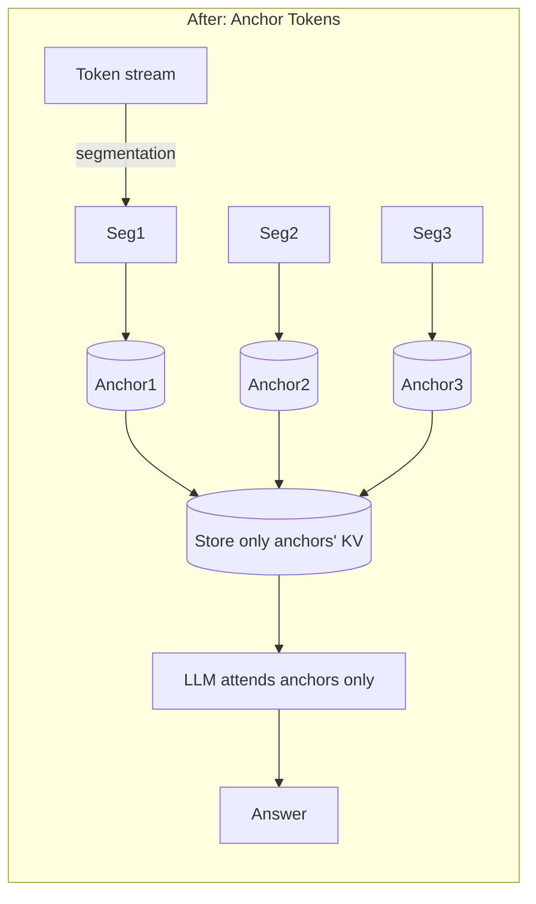

# Anchor Tokens for Latent Compression

**Goal:** Force the model to **summarize segments** into learned **anchor tokens**, then keep only anchors' KV as the latent.

## Before vs After


```mermaid
flowchart LR
  subgraph Current Pipeline (Before)
  A[Input text] --> E[Latent Encoder (frozen/lt)]
  E -->|Z (M×d_z)| Z[(Shared latent wire)]
  Z --> AM1[Per-model Adapter (MLP)]
  AM1 --> P1[Prefix at input-only (shallow)]
  P1 --> T1[Chat Template]
  T1 --> LLM1[LLM (frozen)]
  end
  LLM1 --> O[Answer]
```


**After:**





## What changes
- Add **anchor mask** in attention: non-anchor tokens attend within segment; anchors attend previous anchors.
- During inference, **drop non-anchor KV**, keep anchor KV only (huge memory/time savings).

## Training
- Same LM loss; optionally auxiliary loss to maximize MI between anchors and outputs.
- Maintain **chat template** boundaries; anchors align to assistant turn for QA.

## Expected benefits
- 90–99% KV reduction reported in literature; anchors become a compact interlingua usable across models.

## Integration steps
1. Add an `AnchorMasking` module wrapping the model’s attention mask builder.
2. Insert **anchor tokens** at segment ends (learned embeddings).
3. Modify KV caching to store **only anchors**.
4. Evaluate token-budget vs anchors for the same average bytes.

## Risks
- Segmentation granularity: start with fixed windows (e.g., 64 tokens) and tune.
- Ensure assistant start anchors exist for short-answer tasks.
