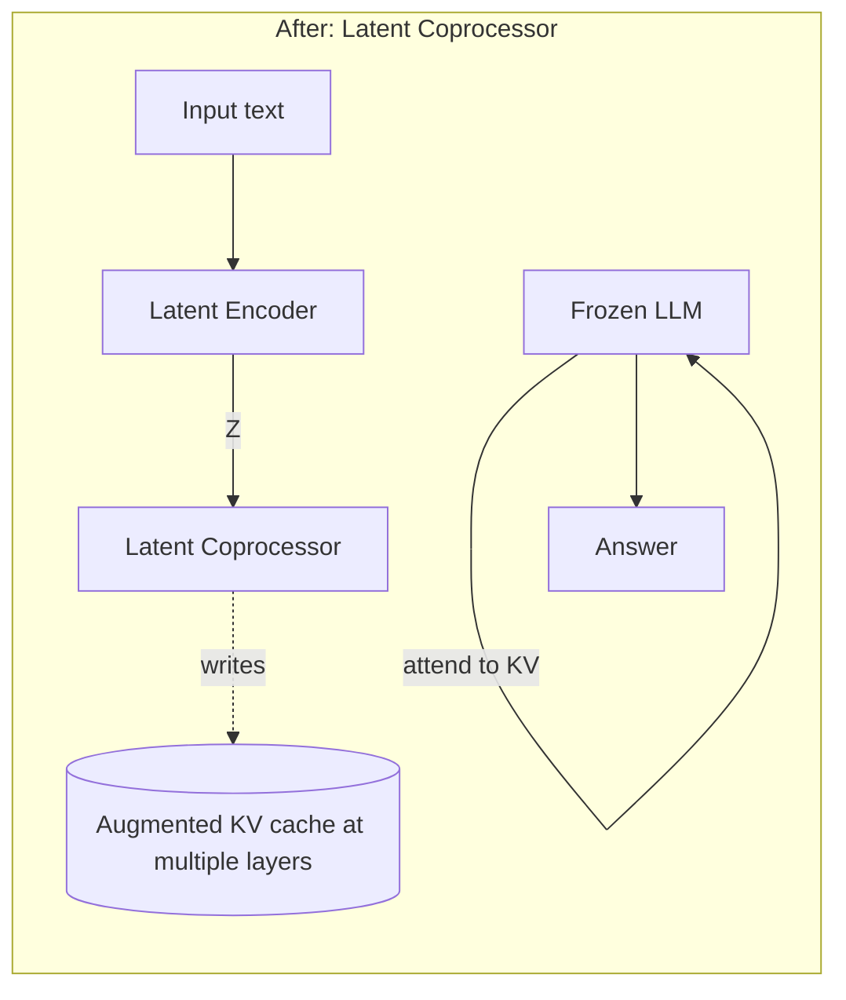

# Latent Coprocessor (Differentiable Cache Augmentation)

**Goal:** Teach a small coprocessor to **write latent vectors directly into the LLM's key/value cache** so a *frozen* LLM can reliably "listen" to a compact interlingua `Z`.

## Before vs After


```mermaid
flowchart LR
  subgraph Current Pipeline (Before)
  A[Input text] --> E[Latent Encoder (frozen/lt)]
  E -->|Z (M×d_z)| Z[(Shared latent wire)]
  Z --> AM1[Per-model Adapter (MLP)]
  AM1 --> P1[Prefix at input-only (shallow)]
  P1 --> T1[Chat Template]
  T1 --> LLM1[LLM (frozen)]
  end
  LLM1 --> O[Answer]
```


**After:**





## What changes
- Add a `LatentCoprocessor` that maps `Z` + (optional) current hidden state → **per-layer** {K,V} deltas.
- During forward, we **augment** the LLM's `past_key_values` with the coprocessor output; base weights remain frozen.
- Train end-to-end on LM loss + first-token/K-token CE + KD from clean text teacher.

## Training signals
- **First-token CE**: ensure acceptance at step 1.
- **K-token CE** (K=8): early stability.
- **KD (τ≈2)** on first K steps from *text teacher* (adapters disabled), to match distributions.
- Optional **hidden-state MSE** on early layers (state KD).

## Expected benefits
- The LLM attends to the latent “notes” at **every layer**, improving acceptance without touching base weights.

## Integration steps
1. Implement `LatentCoprocessor.forward(z, h_states, pkv) -> delta_pkv`.
2. Hook into generation: compute coprocessor deltas before each decoding step; merge with `past_key_values`.
3. Add flags: `--use_coprocessor`, `--coprocessor_layers`, `--coprocessor_width`, `--kd_tau`.
4. Log **first_token_top1**, **KD**, and **magnitude** of cache deltas per layer.

## Risks
- KV augmentation size: keep coprocessor width small (e.g., 256–512). Apply dropout on deltas.
- Stability: use grad clipping and warmup on coprocessor only.
